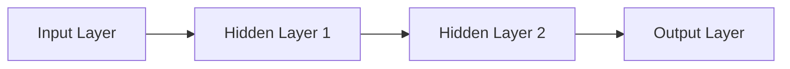
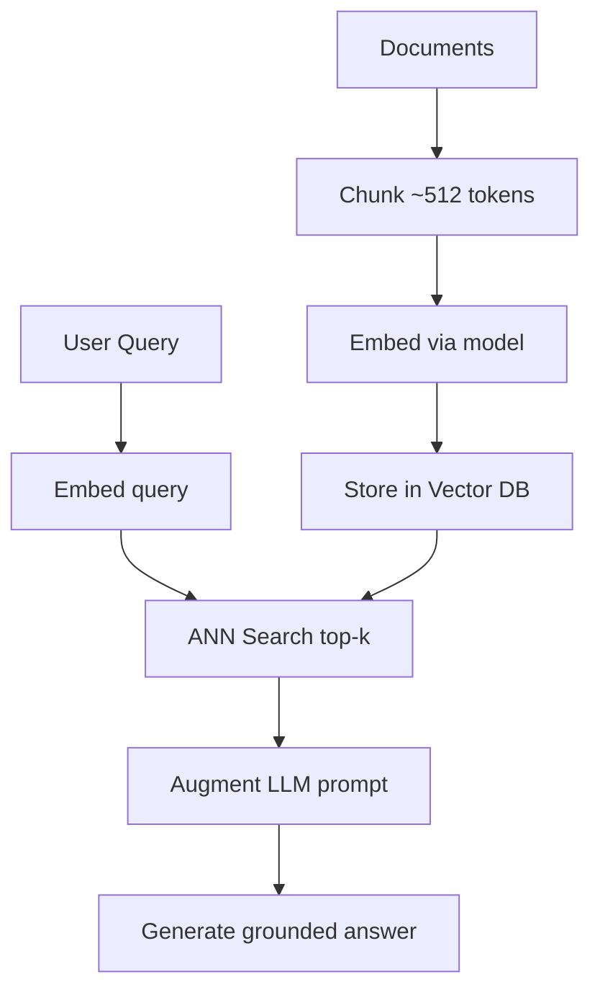
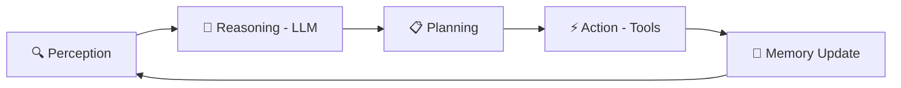
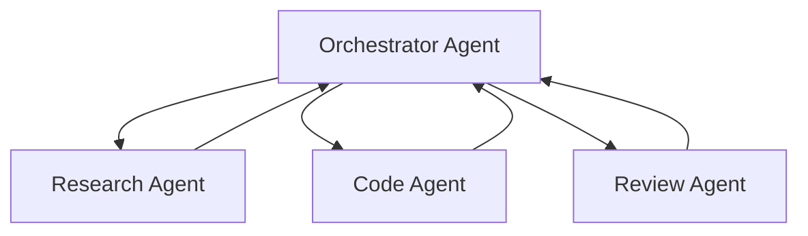

# AI Hands-On Lab

## From Concepts to Code Generation

<div class="pt-12">
  <span class="px-2 py-1 rounded cursor-pointer" hover="bg-white bg-opacity-10">
    Leveraging AI for System Design, Integration & Holistic Problem-Solving
  </span>
</div>

<div class="abs-br m-6 flex gap-2">
  <a href="https://sli.dev" target="_blank" alt="Slidev"
    class="text-xl slidev-icon-btn opacity-50 !border-none !hover:text-white">
    <carbon-presentation-file />
  </a>
</div>

<!--
Welcome to the AI Hands-On Lab. This lab is designed for engineers who want to
leverage AI rather than compete with it.
-->

---
transition: fade-out
---

# The Two Paths

<div class="grid grid-cols-2 gap-8 pt-4">

<div class="border border-red-400/30 rounded-lg p-6 bg-red-900/10">

### ❌ Path 1: Competing with AI

Tasks AI will inevitably master:
- Boilerplate code generation
- Pattern-matching bug fixes
- Rote documentation
- Simple CRUD operations
- Data format conversions

<div class="text-red-400 text-sm mt-4 font-mono">Diminishing returns over time →</div>

</div>

<div class="border border-green-400/30 rounded-lg p-6 bg-green-900/10">

### ✅ Path 2: Leveraging AI

Skills AI struggles with:
- **System design** & architecture
- **Integration strategy** across stacks
- **Holistic problem-solving**
- Domain expertise & judgment
- Stakeholder communication

<div class="text-green-400 text-sm mt-4 font-mono">Compounding value over time →</div>

</div>

</div>

<div class="mt-6 text-center text-sm opacity-75">

> This lab teaches you to be on **Path 2** — using AI as a force multiplier for the hard problems.

</div>

---
layout: section
---

# Part 1: AI Foundations

Understanding the concepts that power modern AI systems

---

# What is Machine Learning?

<div class="grid grid-cols-2 gap-6">

<div>

## The Core Idea

A system that **learns patterns from data** rather than being explicitly programmed.

```
Traditional Programming:
  Input + Rules → Output

Machine Learning:
  Input + Output → Rules (learned)
```

### Three Paradigms

| Type | Learning Signal | Example |
|------|----------------|---------|
| **Supervised** | Labeled data | Spam detection |
| **Unsupervised** | No labels | Customer segmentation |
| **Reinforcement** | Rewards/penalties | Game playing |

</div>

<div>

## Why It Matters Now

- **Data abundance** — internet-scale datasets
- **Compute power** — GPU/TPU acceleration
- **Algorithmic advances** — Transformers (2017→)
- **Open models** — Llama, Mistral, Gemma

### The Bias–Variance Tradeoff

$$E[(y-\hat{y})^2] = \text{Bias}^2(\hat{y}) + \text{Var}(\hat{y}) + \sigma^2$$

- **Bias**: systematic error (underfitting)
- **Variance**: sensitivity to training data (overfitting)
- **σ²**: irreducible noise

</div>

</div>

---

# Neural Networks & Deep Learning

<div class="grid grid-cols-2 gap-6">

<div>

## Architecture



### Training Loop

1. **Forward pass** — compute predictions
2. **Loss computation** — measure error
3. **Backpropagation** — compute gradients
4. **Optimizer step** — update weights (SGD/Adam)

### Key Activations

| Function | Range | Use Case |
|----------|-------|----------|
| ReLU | [0, ∞) | Hidden layers |
| Sigmoid | (0, 1) | Binary output |
| Softmax | (0, 1) sum=1 | Multi-class |

</div>

<div>

## Transformers — The Revolution

$$\text{Attention}(Q,K,V) = \text{softmax}\left(\frac{QK^T}{\sqrt{d_k}}\right)V$$

**Why Transformers won:**
- Parallel training (no recurrence)
- Long-range dependencies via self-attention
- Scale efficiently with compute

### Key Architectures

- **BERT** — encoder-only (understanding)
- **GPT** — decoder-only (generation)
- **T5** — encoder-decoder (seq2seq)

### Modern LLMs

| Model | Parameters | Context |
|-------|-----------|---------|
| GPT-4o | ~1.8T (MoE) | 128K |
| Claude 3.5 | undisclosed | 200K |
| Llama 3 | 8B–405B | 128K |

</div>

</div>

---

# Large Language Models (LLMs)

<div id="llm-concepts">

## How LLMs Work

LLMs are **next-token prediction** machines trained on internet-scale text.

</div>

<div class="grid grid-cols-3 gap-4 mt-4">

<div class="border border-blue-400/30 rounded p-4 bg-blue-900/10">

### 🎛️ Key Parameters

- **Temperature** — 0 = deterministic, 1 = creative
- **Top-k / Top-p** — nucleus sampling
- **Context window** — max input tokens
- **System prompt** — defines behavior

</div>

<div class="border border-green-400/30 rounded p-4 bg-green-900/10">

### 🧠 Prompting Techniques

- **Zero-shot** — direct instruction
- **Few-shot** — examples in context
- **Chain-of-Thought** — "think step by step"
- **ReAct** — reason + act interleaved

</div>

<div class="border border-purple-400/30 rounded p-4 bg-purple-900/10">

### ⚡ Practical Tips

- Be specific in instructions
- Provide output format examples
- Use system prompts for persona
- Break complex tasks into steps

</div>

</div>

<div class="mt-4 text-sm bg-gray-800/50 p-4 rounded">

**Lab Exercise**: Open your AI assistant and try these prompts:
```
❌ "Write code for a web app"
✅ "Write a Python FastAPI endpoint that accepts a JSON body with fields 
   'name' (string) and 'age' (int), validates inputs, and returns a 
   greeting message. Include error handling and type hints."
```

</div>

---
layout: section
---

# Part 2: Retrieval-Augmented Generation (RAG)

Grounding AI in your data

---

# RAG — The Pattern That Changed Everything

<div class="grid grid-cols-2 gap-6">

<div>

## Why RAG?

LLMs have a **knowledge cutoff** and can **hallucinate**. RAG grounds responses in your actual data.

### The RAG Pipeline



</div>

<div>

## Key Components

### Embedding Models
- OpenAI `text-embedding-3-small`
- Cohere Embed v3
- Open-source: BGE, E5, GTE

### Vector Databases
- **Pinecone** — managed, fast
- **Weaviate** — hybrid search
- **Chroma** — local, lightweight
- **pgvector** — PostgreSQL extension

### Retrieval Strategies

| Strategy | Strength |
|----------|----------|
| BM25 (sparse) | Exact keyword match |
| Dense (embedding) | Semantic meaning |
| Hybrid (RRF) | Best of both |
| Cross-encoder rerank | Highest accuracy |

</div>

</div>

---

# Hands-On: Building a RAG Pipeline

```python
# Step 1: Install dependencies
# pip install chromadb openai langchain

from langchain.text_splitter import RecursiveCharacterTextSplitter
from langchain_community.vectorstores import Chroma
from langchain_openai import OpenAIEmbeddings, ChatOpenAI
from langchain.chains import RetrievalQA

# Step 2: Chunk your documents
splitter = RecursiveCharacterTextSplitter(chunk_size=512, chunk_overlap=50)
docs = splitter.create_documents(["Your document text here..."])

# Step 3: Create vector store
embeddings = OpenAIEmbeddings(model="text-embedding-3-small")
vectorstore = Chroma.from_documents(docs, embeddings, persist_directory="./db")

# Step 4: Build retrieval chain
llm = ChatOpenAI(model="gpt-4o", temperature=0)
qa_chain = RetrievalQA.from_chain_type(
    llm=llm,
    retriever=vectorstore.as_retriever(search_kwargs={"k": 5}),
    return_source_documents=True
)

# Step 5: Query
result = qa_chain.invoke({"query": "What is the bias-variance tradeoff?"})
print(result["result"])
```

<div class="mt-2 text-sm text-green-400">

💡 **Lab Task**: Replace the document text with content from your own project docs and observe how retrieval quality changes with different chunk sizes.

</div>

---
layout: section
---

# Part 3: Agentic AI

Building systems that reason, plan, and act

---

# Anatomy of an AI Agent

<div id="agent-anatomy">



</div>

<div class="grid grid-cols-2 gap-6 mt-4">

<div>

## Agent Architectures

| Pattern | How It Works |
|---------|-------------|
| **ReAct** | Reason → Act → Observe loop |
| **Plan-and-Execute** | Plan subtasks, then execute |
| **Reflexion** | Self-critique and retry |
| **LATS** | LLM + tree search |

## Memory Systems

| Type | Implementation |
|------|---------------|
| In-context | Token window |
| Semantic | Vector DB |
| Episodic | Past trajectories |
| Procedural | Skills/tools |

</div>

<div>

## Tool Use & Function Calling

Tools are defined as JSON schemas. The LLM decides **when** and **which** to call.

```json
{
  "name": "search_docs",
  "description": "Search internal documentation",
  "parameters": {
    "type": "object",
    "properties": {
      "query": {
        "type": "string",
        "description": "Search query"
      }
    },
    "required": ["query"]
  }
}
```

The LLM sees the schema and invokes tools based on user intent — no hardcoded logic.

</div>

</div>

---

# Model Context Protocol (MCP)

<div class="text-center mb-4 text-lg opacity-75">

"USB-C for AI" — One protocol, any data source

</div>

<div class="grid grid-cols-2 gap-6">

<div>

## Architecture

```
┌─────────────┐     JSON-RPC      ┌────────────┐
│  Host App   │ ←───────────────→ │ MCP Client │
│ (Claude,    │                    │  (1:1 with │
│  Cursor)    │                    │   server)  │
└─────────────┘                    └─────┬──────┘
                                         │ stdio / HTTP+SSE
                                   ┌─────┴──────┐
                                   │ MCP Server │
                                   │ (Your code)│
                                   └─────┬──────┘
                                         │
                                   ┌─────┴──────┐
                                   │  Backend   │
                                   │ DB/API/FS  │
                                   └────────────┘
```

## Three Primitives

| Primitive | Role | Analogy |
|-----------|------|---------|
| **Tools** | Executable functions | POST endpoints |
| **Resources** | Read-only data | GET endpoints |
| **Prompts** | Template prompts | Pre-built queries |

</div>

<div>

## Building an MCP Server (Python)

```python
from mcp.server import Server
from mcp.server.stdio import stdio_server
from mcp.types import Tool, TextContent

app = Server("my-mcp-server")

@app.list_tools()
async def list_tools():
    return [Tool(
        name="query_database",
        description="Run a read-only SQL query",
        inputSchema={
            "type": "object",
            "properties": {
                "sql": {"type": "string"}
            },
            "required": ["sql"]
        }
    )]

@app.call_tool()
async def call_tool(name, arguments):
    if name == "query_database":
        result = execute_query(arguments["sql"])
        return [TextContent(
            type="text", text=str(result)
        )]

async def main():
    async with stdio_server() as (r, w):
        await app.run(
            r, w,
            app.create_initialization_options()
        )
```

</div>

</div>

---

# Multi-Agent Systems

<div class="grid grid-cols-2 gap-6">

<div>

## Orchestration Patterns



### Frameworks

| Framework | Style | Strength |
|-----------|-------|----------|
| **LangGraph** | Stateful graph | Fine control |
| **CrewAI** | Role-based crews | Easy setup |
| **AutoGen** | Conversational | Flexibility |
| **Swarm** | Lightweight | Simplicity |

</div>

<div>

## Agent Interoperability Protocols

### A2A (Agent-to-Agent) — Google

Agents discover each other via **Agent Cards** and collaborate on tasks.

```json
{
  "name": "research-agent",
  "description": "Searches and summarizes",
  "url": "https://agent.example.com",
  "skills": [
    {
      "id": "web-search",
      "inputModes": ["text/plain"],
      "outputModes": ["text/markdown"]
    }
  ]
}
```

### AGNTCY — Agent Interoperability

- **Agent Connect Protocol (ACP)** — REST API for agent communication
- **Agent Directory** — searchable registry of agent capabilities
- **Workflow Engine** — compose multi-framework DAGs

</div>

</div>

---
layout: section
---

# Part 4: Reducing Startup Cost

Using AI for problem solving & code generation

---

# AI-Assisted Problem Solving Framework

<div id="problem-solving">

## The 5-Step AI-Augmented Approach

</div>

<div class="grid grid-cols-5 gap-2 mt-4">

<div class="border border-cyan-400/30 rounded p-3 bg-cyan-900/10 text-center text-xs">

### 1️⃣ Define
Clarify the problem with AI help

*"Describe the constraints and edge cases for..."*

</div>

<div class="border border-blue-400/30 rounded p-3 bg-blue-900/10 text-center text-xs">

### 2️⃣ Research
AI searches docs, papers, examples

*"What are the common approaches for..."*

</div>

<div class="border border-purple-400/30 rounded p-3 bg-purple-900/10 text-center text-xs">

### 3️⃣ Design
You architect, AI validates

*"Review this system design for..."*

</div>

<div class="border border-green-400/30 rounded p-3 bg-green-900/10 text-center text-xs">

### 4️⃣ Implement
AI generates, you refine

*"Write the implementation for..."*

</div>

<div class="border border-yellow-400/30 rounded p-3 bg-yellow-900/10 text-center text-xs">

### 5️⃣ Verify
AI writes tests, reviews code

*"Write unit tests that cover..."*

</div>

</div>

<div class="mt-6 bg-gray-800/50 p-4 rounded">

### Key Principle: You Are the Architect, AI Is the Builder

| You (Human) | AI (Assistant) |
|-------------|----------------|
| Define requirements | Generate boilerplate |
| Design architecture | Implement components |
| Make integration decisions | Write tests |
| Validate correctness | Refactor & optimize |
| Own the outcome | Suggest alternatives |

</div>

---

# Effective Prompting for Code Generation

<div class="grid grid-cols-2 gap-6">

<div>

## Prompt Engineering Patterns

### 1. Specification-First Prompting

```markdown
## Task
Build a REST API endpoint

## Requirements
- POST /api/users
- Validate: email (valid format), name (2-50 chars)
- Store in PostgreSQL via SQLAlchemy
- Return 201 with created user
- Return 422 with validation errors

## Constraints
- Python 3.12, FastAPI, Pydantic v2
- Async database operations
- Follow existing project patterns

## Output Format
- Single file with all imports
- Include docstrings
- Include type hints
```

### 2. Context-Loading

```
Here is my existing code structure:
[paste relevant files]

Now add a new feature that...
```

</div>

<div>

## Anti-Patterns to Avoid

<div class="space-y-3">

<div class="border border-red-400/30 rounded p-3 bg-red-900/10">

❌ **Vague prompts**
"Make it better" / "Fix this code"

</div>

<div class="border border-red-400/30 rounded p-3 bg-red-900/10">

❌ **No context**
Asking for code without specifying language, framework, or constraints

</div>

<div class="border border-red-400/30 rounded p-3 bg-red-900/10">

❌ **Blind acceptance**
Copying AI output without understanding or testing it

</div>

<div class="border border-green-400/30 rounded p-3 bg-green-900/10">

✅ **The right approach**
1. Provide full context
2. Specify exact requirements
3. Review generated code critically
4. Test before integrating
5. Iterate with feedback

</div>

</div>

</div>

</div>

---

# Lab Exercise: AI-Powered Development Workflow

<div class="grid grid-cols-2 gap-6">

<div>

## Scenario

Build a CLI tool that analyzes a Git repository and generates a summary report.

### Step 1: Design with AI

```
Prompt: "I need to build a Python CLI tool that:
1. Takes a git repo path as input
2. Analyzes commit frequency by author
3. Identifies most-changed files
4. Generates a markdown report

Design the module structure and 
key interfaces. Don't write implementation 
yet — just the architecture."
```

### Step 2: Implement with AI

```
Prompt: "Based on the design above, 
implement the git_analyzer.py module.
Use gitpython library. Include:
- Type hints throughout
- Dataclass for CommitStats
- Error handling for invalid repos
- Unit-testable functions"
```

</div>

<div>

### Step 3: Test with AI

```
Prompt: "Write pytest tests for the 
git_analyzer module. Include:
- Test with a mock git repo (use tmp_path)
- Edge case: empty repo
- Edge case: single commit
- Verify markdown output format"
```

### Step 4: Review & Refine

```
Prompt: "Review this implementation for:
- Security issues (path traversal?)
- Performance with large repos (1000+ commits)
- Missing edge cases
- Code style improvements"
```

<div class="mt-4 p-3 border border-green-400/30 rounded bg-green-900/10 text-sm">

💡 **Key Insight**: Notice how you're driving the *what* and *why*, while AI handles the *how*. This is the leverage pattern.

</div>

</div>

</div>

---
layout: section
---

# Part 5: Hands-On Labs

Putting it all together

---

# Lab 1: Build Your First MCP Server

<template>
  <div>
    <v-tour name="mcpTour" :steps="mcpSteps"></v-tour>
    <button @click="startMcpTour" class="px-4 py-2 bg-blue-500 text-white rounded hover:bg-blue-600 transition text-sm mb-4">
      🎯 Start Guided Tour
    </button>
  </div>
</template>

<script setup>
import { ref, getCurrentInstance } from 'vue'

const mcpSteps = ref([
  { target: '#mcp-goal', content: 'First, understand what we are building — an MCP server that exposes tools to any AI assistant.' },
  { target: '#mcp-setup', content: 'Set up the project with the MCP Python SDK.' },
  { target: '#mcp-implement', content: 'Implement your tool logic here. The LLM will invoke this based on the schema you define.' },
  { target: '#mcp-test', content: 'Test your server using the MCP Inspector tool before connecting to a real host.' }
])

const { proxy } = getCurrentInstance()
const startMcpTour = () => { proxy.$tours['mcpTour'].start() }
</script>

<div class="grid grid-cols-2 gap-4 text-sm">

<div>

<div id="mcp-goal">

### 🎯 Goal
Create an MCP server that provides a **file search** tool to any AI assistant.

</div>

<div id="mcp-setup">

### 📦 Setup
```bash
mkdir my-mcp-server && cd my-mcp-server
python -m venv .venv && source .venv/bin/activate
pip install mcp
```

</div>

</div>

<div>

<div id="mcp-implement">

### 🔧 Implement (`server.py`)
```python
from mcp.server import Server
from mcp.server.stdio import stdio_server
from mcp.types import Tool, TextContent
import os, glob

app = Server("file-search")

@app.list_tools()
async def list_tools():
    return [Tool(name="find_files",
        description="Search for files by pattern",
        inputSchema={"type": "object",
            "properties": {"pattern": {"type":"string"}},
            "required": ["pattern"]})]

@app.call_tool()
async def call_tool(name, arguments):
    files = glob.glob(f"**/{arguments['pattern']}",
                      recursive=True)
    return [TextContent(type="text",
        text="\n".join(files[:20]))]
```

</div>

<div id="mcp-test">

### ✅ Test
```bash
npx @modelcontextprotocol/inspector \
  python server.py
```

</div>

</div>

</div>

---

# Lab 2: RAG Pipeline with Local LLM

<template>
  <div>
    <v-tour name="ragTour" :steps="ragSteps"></v-tour>
    <button @click="startRagTour" class="px-4 py-2 bg-green-500 text-white rounded hover:bg-green-600 transition text-sm mb-4">
      🎯 Start Guided Tour
    </button>
  </div>
</template>

<script setup>
import { ref, getCurrentInstance } from 'vue'

const ragSteps = ref([
  { target: '#rag-deps', content: 'Install the core libraries: an embedding model, vector store, and LLM interface.' },
  { target: '#rag-ingest', content: 'Ingest documents by chunking them and storing embeddings.' },
  { target: '#rag-query', content: 'Query the pipeline — retrieval + generation in one call.' },
  { target: '#rag-experiment', content: 'Experiment with these parameters to understand their impact on quality.' }
])

const { proxy } = getCurrentInstance()
const startRagTour = () => { proxy.$tours['ragTour'].start() }
</script>

<div class="grid grid-cols-2 gap-4 text-sm">

<div>

<div id="rag-deps">

### 📦 Dependencies
```bash
pip install chromadb sentence-transformers \
  ollama langchain langchain-community
ollama pull llama3.2
ollama pull nomic-embed-text
```

</div>

<div id="rag-ingest">

### 📄 Ingest Documents
```python
from langchain_community.vectorstores import Chroma
from langchain_community.embeddings import OllamaEmbeddings
from langchain.text_splitter import (
    RecursiveCharacterTextSplitter
)

splitter = RecursiveCharacterTextSplitter(
    chunk_size=512, chunk_overlap=50
)
docs = splitter.create_documents([your_text])

embeddings = OllamaEmbeddings(model="nomic-embed-text")
db = Chroma.from_documents(docs, embeddings)
```

</div>

</div>

<div>

<div id="rag-query">

### 🔍 Query
```python
from langchain_community.llms import Ollama
from langchain.chains import RetrievalQA

llm = Ollama(model="llama3.2")
qa = RetrievalQA.from_chain_type(
    llm=llm,
    retriever=db.as_retriever(
        search_kwargs={"k": 5}
    )
)
result = qa.invoke(
    {"query": "Explain bias-variance tradeoff"}
)
print(result["result"])
```

</div>

<div id="rag-experiment">

### 🧪 Experiment

| Parameter | Try | Effect |
|-----------|-----|--------|
| `chunk_size` | 256 vs 1024 | Precision vs context |
| `k` | 3 vs 10 | Focus vs coverage |
| `chunk_overlap` | 0 vs 100 | Continuity |
| Embedding model | swap models | Quality |

</div>

</div>

</div>

---

# Lab 3: Multi-Agent Code Review System

<div class="text-xs">

### 🎯 Build a team of agents that collaborate to review code

```python
from crewai import Agent, Task, Crew

security_agent = Agent(role="Security Analyst",
    goal="Find security vulnerabilities in code",
    backstory="Expert in OWASP Top 10, injection attacks, auth flaws", llm="ollama/llama3.2")

perf_agent = Agent(role="Performance Engineer",
    goal="Identify performance bottlenecks and optimization opportunities",
    backstory="Expert in algorithmic complexity, caching, DB optimization", llm="ollama/llama3.2")

quality_agent = Agent(role="Code Quality Reviewer",
    goal="Ensure code follows best practices and is maintainable",
    backstory="Expert in SOLID principles, design patterns, clean code", llm="ollama/llama3.2")

# Define tasks
code_to_review = open("your_code.py").read()

review_tasks = [
    Task(description=f"Review for security:\n{code_to_review}", agent=security_agent),
    Task(description=f"Review for performance:\n{code_to_review}", agent=perf_agent),
    Task(description=f"Review for quality:\n{code_to_review}", agent=quality_agent),
]

crew = Crew(agents=[security_agent, perf_agent, quality_agent], tasks=review_tasks)
result = crew.kickoff()
```

</div>

---

# Lab 4: AI for AWS Infrastructure (SRE)

<template>
  <div>
    <v-tour name="sreTour" :steps="sreSteps"></v-tour>
    <button @click="startSreTour" class="px-4 py-2 bg-orange-500 text-white rounded hover:bg-orange-600 transition text-sm mb-4">
      🎯 Start Guided Tour
    </button>
  </div>
</template>

<script setup>
import { ref, getCurrentInstance } from 'vue'

const sreSteps = ref([
  { target: '#sre-scenario', content: 'This lab simulates a real SRE workflow — an incident fires, and you use AI to accelerate triage and remediation.' },
  { target: '#sre-iac', content: 'Use AI to generate and review Terraform. The key is providing your existing module patterns as context.' },
  { target: '#sre-incident', content: 'Build an MCP server that gives your AI assistant direct access to CloudWatch and incident data.' },
  { target: '#sre-runbook', content: 'AI generates runbooks from your past incident history — turn tribal knowledge into documentation.' }
])

const { proxy } = getCurrentInstance()
const startSreTour = () => { proxy.$tours['sreTour'].start() }
</script>

<div class="grid grid-cols-2 gap-4 text-xs">

<div>

<div id="sre-scenario">

### 🎯 Scenario
You're an SRE managing AWS infrastructure. An alarm fires for high ECS task failure rate. Use AI to triage, fix, and prevent recurrence.

</div>

<div id="sre-iac">

### 1️⃣ AI-Assisted Terraform
```hcl
# Prompt: "Generate a Terraform module for an ECS 
# Fargate service with ALB, auto-scaling (CPU > 70%),
# CloudWatch alarms for task failures and 5xx rates.
# Use our existing VPC module as a data source."

resource "aws_ecs_service" "app" {
  name            = var.service_name
  cluster         = aws_ecs_cluster.main.id
  task_definition = aws_ecs_task_definition.app.arn
  desired_count   = var.min_capacity
  launch_type     = "FARGATE"
  network_configuration {
    subnets         = data.aws_subnets.private.ids
    security_groups = [aws_security_group.ecs.id]
  }
}

resource "aws_cloudwatch_metric_alarm" "task_failures" {
  alarm_name          = "${var.service_name}-task-fail"
  comparison_operator = "GreaterThanThreshold"
  evaluation_periods  = 2
  metric_name         = "TaskFailures"
  namespace           = "ECS/ContainerInsights"
  period              = 300
  statistic           = "Sum"
  threshold           = 5
}
```

</div>

</div>

<div>

<div id="sre-incident">

### 2️⃣ Build an AWS MCP Server
```python
from mcp.server import Server
from mcp.types import Tool, TextContent
import boto3

app = Server("aws-sre-tools")

@app.list_tools()
async def list_tools():
    return [
      Tool(name="get_alarms",
        description="List active CloudWatch alarms",
        inputSchema={"type":"object","properties":{}}),
      Tool(name="get_ecs_events",
        description="Get recent ECS service events",
        inputSchema={"type":"object","properties":{
          "cluster":{"type":"string"},
          "service":{"type":"string"}},
          "required":["cluster","service"]})]

@app.call_tool()
async def call_tool(name, args):
    if name == "get_alarms":
        cw = boto3.client("cloudwatch")
        alarms = cw.describe_alarms(
            StateValue="ALARM")["MetricAlarms"]
        return [TextContent(type="text",
            text=str([a["AlarmName"] for a in alarms]))]
```

</div>

<div id="sre-runbook">

### 3️⃣ AI-Generated Runbooks

```
Prompt: "Given these 12 past incident reports from
PagerDuty (attached), generate a runbook for
'ECS Task Failure Rate > threshold' that includes:
- Triage decision tree
- Common root causes with AWS CLI commands
- Escalation criteria
- Rollback procedures for ECS deployments"
```

</div>

</div>

</div>

---

# Lab 5: AI for Managed Service Providers (MSP)

<template>
  <div>
    <v-tour name="mspTour" :steps="mspSteps"></v-tour>
    <button @click="startMspTour" class="px-4 py-2 bg-teal-500 text-white rounded hover:bg-teal-600 transition text-sm mb-4">
      🎯 Start Guided Tour
    </button>
  </div>
</template>

<script setup>
import { ref, getCurrentInstance } from 'vue'

const mspSteps = ref([
  { target: '#msp-scenario', content: 'MSP engineers juggle dozens of client environments. AI dramatically reduces context-switching cost.' },
  { target: '#msp-triage', content: 'Build an AI pipeline that pre-triages incoming tickets, so you start with context instead of hunting for it.' },
  { target: '#msp-rmm', content: 'Connect your RMM platform to an AI assistant via MCP — query device status, run scripts, pull alerts without switching tabs.' },
  { target: '#msp-sop', content: 'Turn your best technician\'s knowledge into AI-searchable SOPs. New hires get answers in seconds.' }
])

const { proxy } = getCurrentInstance()
const startMspTour = () => { proxy.$tours['mspTour'].start() }
</script>

<div class="grid grid-cols-2 gap-4 text-xs">

<div>

<div id="msp-scenario">

### 🎯 Scenario
You manage 50+ client environments via NinjaRMM. A ticket arrives: *"Backups failing on ACME-DC01 for 3 days."* Use AI to resolve it in minutes, not hours.

</div>

<div id="msp-triage">

### 1️⃣ AI Ticket Triage Pipeline
```python
from pydantic import BaseModel
from openai import OpenAI

class TriagedTicket(BaseModel):
    priority: str      # P1-P4
    category: str      # backup, network, auth, etc.
    client_impact: str  # description of business impact
    suggested_steps: list[str]
    needs_escalation: bool
    relevant_sop: str   # SOP doc reference

client = OpenAI()
resp = client.beta.chat.completions.parse(
    model="gpt-4o",
    messages=[
      {"role": "system", "content": """You are an MSP
      L1 triage assistant. Classify tickets, assess
      impact, and recommend next steps. Reference
      internal SOPs when applicable."""},
      {"role": "user", "content": ticket_text}
    ],
    response_format=TriagedTicket
)
triaged = resp.choices[0].message.parsed
# triaged.priority → "P2"
# triaged.suggested_steps → [...]
```

</div>

</div>

<div>

<div id="msp-rmm">

### 2️⃣ NinjaRMM MCP Server
```python
from mcp.server import Server
from mcp.types import Tool, TextContent
import requests

app = Server("ninja-rmm-tools")
API = "https://app.ninjarmm.com/api/v2"
HEADERS = {"Authorization": f"Bearer {TOKEN}"}

@app.list_tools()
async def list_tools():
    return [
      Tool(name="get_device_status",
        description="Get device health and alerts",
        inputSchema={"type":"object","properties":{
          "device_name":{"type":"string"}},
          "required":["device_name"]}),
      Tool(name="get_failed_backups",
        description="List devices with backup failures",
        inputSchema={"type":"object","properties":{
          "org_id":{"type":"string"}},
          "required":["org_id"]})]

@app.call_tool()
async def call_tool(name, args):
    if name == "get_device_status":
        r = requests.get(f"{API}/devices",
            headers=HEADERS,
            params={"name": args["device_name"]})
        return [TextContent(type="text",
            text=str(r.json()))]
```

</div>

<div id="msp-sop">

### 3️⃣ RAG over SOPs & Client Docs
```
Prompt: "Build a RAG pipeline over:
- /docs/sops/ (200+ standard procedures)
- /docs/clients/ (per-client configurations)
- /docs/kb/ (knowledge base articles)

When a tech asks 'How do I fix Veeam error 
4005 for ACME Corp?', retrieve both the 
generic SOP AND ACME's specific backup config."
```

💡 **MSP Leverage**: One AI-powered knowledge base replaces hours of searching Confluence, SharePoint, and Slack history.

</div>

</div>

</div>

---

# Lab 6a: Local AI Agents — Overview & Hardware

<template>
  <div>
    <v-tour name="localOverviewTour" :steps="overviewSteps"></v-tour>
    <button @click="startOverviewTour" class="px-4 py-2 bg-rose-500 text-white rounded hover:bg-rose-600 transition text-sm mb-4">
      🎯 Start Guided Tour
    </button>
  </div>
</template>

<script setup>
import { ref, getCurrentInstance } from 'vue'

const overviewSteps = ref([
  { target: '#local-why', content: 'Local agents give you full privacy and zero API costs — ideal for sensitive data and autonomous operation.' },
  { target: '#local-gpu', content: 'Model size determines GPU requirements. This table helps you pick the right model for your hardware.' },
  { target: '#local-arch', content: 'The full local stack: OpenClaw handles multi-channel messaging, Hermes executes autonomously, Ollama runs inference.' }
])

const { proxy } = getCurrentInstance()
const startOverviewTour = () => { proxy.$tours['localOverviewTour'].start() }
</script>

<div class="grid grid-cols-2 gap-4 text-xs">

<div>

<div id="local-why">

### 🎯 Why Local AI Agents?
- **Data privacy** — nothing leaves your machine
- **Zero API costs** — run inference on your own GPU/CPU
- **Offline capable** — works without internet
- **Customizable** — uncensored/fine-tuned models, custom tools
- **Multi-channel** — WhatsApp, Telegram, Slack, Discord, CLI
- **Full autonomy** — agents can execute shell commands, write files

</div>

<div id="local-gpu">

### 🖥️ GPU & Hardware Requirements

| Model | Params | VRAM Required | Speed | Quality |
|-------|--------|---------------|-------|---------|
| Qwen3 0.6B | 0.6B | 1 GB | ⚡⚡⚡ | Basic |
| Gemma3 4B | 4B | 4 GB | ⚡⚡⚡ | Good |
| Qwen3 8B | 8B | 6 GB | ⚡⚡ | Strong |
| Gemma3 12B | 12B | 8 GB | ⚡⚡ | Very strong |
| Llama 4 Scout | 17B (MoE) | 12 GB | ⚡ | Excellent |
| Qwen3 32B | 32B | 20 GB | ⚡ | Near-frontier |
| Llama 4 Maverick | 109B (MoE) | 48 GB+ | 🐢 | Frontier-class |

**Minimum viable setup:**
- **CPU-only** (Apple Silicon M1+): 8B models run at ~15 tok/s on 16GB RAM
- **Entry GPU** (RTX 3060 12GB / M1 Pro 16GB): 8B–12B at good speed
- **Mid GPU** (RTX 4090 24GB / M2 Ultra 64GB): 32B comfortably
- **Multi-GPU** (2× 4090 / A100 80GB): 70B+ models

**Quantization** matters: Q4_K_M uses ~50% less VRAM vs FP16 with minimal quality loss.

</div>

</div>

<div>

<div id="local-arch">

### 🏗️ Full Local Agent Architecture

```
┌──────────────────────────────────────┐
│  You (WhatsApp / Telegram / Slack /  │
│       Discord / CLI / Web UI)        │
└──────────────────┬───────────────────┘
                   │ message
┌──────────────────▼───────────────────┐
│  🦞 OpenClaw Gateway (port 18789)    │
│  Multi-channel inbox & routing       │
│  Session management & memory         │
│  Tool orchestration                  │
└──────────────────┬───────────────────┘
                   │ task delegation
┌──────────────────▼───────────────────┐
│  🧠 Hermes Agent (autonomous exec)   │
│  Goal decomposition & planning       │
│  Tool use: shell, fs, python, web    │
│  Self-verification & retry           │
└──────────────────┬───────────────────┘
                   │ inference
┌──────────────────▼───────────────────┐
│  🦙 Ollama (port 11434)              │
│  Model: gemma3:12b / qwen3:8b        │
│  GPU-accelerated inference           │
└──────────────────────────────────────┘
```

### 📋 Prerequisites Checklist
- [ ] Docker & Docker Compose installed
- [ ] Ollama installed (`brew install ollama` or [ollama.com](https://ollama.com))
- [ ] At least 16 GB RAM (32 GB recommended)
- [ ] GPU with 8+ GB VRAM (or Apple Silicon M1+)
- [ ] Python 3.11+ with pip/uv
- [ ] Ollama running: `ollama serve`

</div>

</div>

</div>

---

# Lab 6b: Deploy OpenClaw — Personal AI Assistant

<template>
  <div>
    <v-tour name="openclawTour" :steps="clawSteps"></v-tour>
    <button @click="startClawTour" class="px-4 py-2 bg-red-500 text-white rounded hover:bg-red-600 transition text-sm mb-4">
      🦞 Start Guided Tour
    </button>
  </div>
</template>

<script setup>
import { ref, getCurrentInstance } from 'vue'

const clawSteps = ref([
  { target: '#claw-what', content: 'OpenClaw is your 24/7 personal AI assistant accessible from any messaging platform — all running on your hardware.' },
  { target: '#claw-setup', content: 'The setup uses Docker Compose with an external network so OpenClaw can communicate with Ollama and other services.' },
  { target: '#claw-config', content: 'The config file controls which model to use, which channels to enable, and agent behavior settings.' },
  { target: '#claw-channels', content: 'Connect your preferred messaging apps. Each channel is a plugin — enable only what you need.' },
  { target: '#claw-verify', content: 'After deployment, verify the gateway is healthy and test with the built-in CLI channel.' }
])

const { proxy } = getCurrentInstance()
const startClawTour = () => { proxy.$tours['openclawTour'].start() }
</script>

<div class="grid grid-cols-2 gap-4 text-xs">

<div>

<div id="claw-what">

### 🦞 What is OpenClaw?
Open-source personal AI assistant — one gateway serves multiple channels (WhatsApp, Telegram, Slack, Discord, CLI). Your data stays on your machine.

</div>

<div id="claw-setup">

### 📦 Step 1: Project Setup
```bash
# Create project structure
mkdir -p openclaw/{config,workspace,tmp}
cd openclaw

# Create the Docker network (shared with Ollama)
docker network create ai_net

# Pull your preferred model
ollama pull gemma3:12b
```

### 🐳 Step 2: Docker Compose
```yaml
# docker-compose.yml
networks:
  ai_net:
    external: true

services:
  openclaw-gateway:
    image: openclaw/agent:latest
    networks: [ai_net]
    env_file: ".env"
    volumes:
      - ./tmp:/tmp
      - ./config:/home/node/.openclaw
      - ./workspace:/home/node/.openclaw/workspace
    ports:
      - "18789:18789"   # Gateway API
      - "18790:18790"   # Bridge (channel connections)
    init: true
    restart: unless-stopped
    command:
      - "node"
      - "dist/index.js"
      - "gateway"
      - "--bind"
      - "lan"
      - "--port"
      - "18789"
      - "--allow-unconfigured"

  openclaw-cli:
    profiles: [cli]
    image: openclaw/agent:latest
    networks: [ai_net]
    env_file: ".env"
    volumes:
      - ./config:/home/node/.openclaw
      - ./workspace:/home/node/.openclaw/workspace
    stdin_open: true
    tty: true
    init: true
    entrypoint: ["node", "dist/index.js"]
```

</div>

</div>

<div>

<div id="claw-config">

### ⚙️ Step 3: Configuration
```bash
# .env file
OPENCLAW_IMAGE=openclaw/agent:latest
OPENCLAW_CONFIG_DIR=./config
OPENCLAW_WORKSPACE_DIR=./workspace
OPENCLAW_GATEWAY_PORT=18789
OPENCLAW_BRIDGE_PORT=18790
OPENCLAW_GATEWAY_BIND=lan
OLLAMA_BASE_URL=http://host.docker.internal:11434
```

```json
// config/openclaw.json
{
  "agents": {
    "defaults": {
      "model": {
        "primary": "ollama/gemma3:12b"
      }
    }
  },
  "gateway": {
    "channels": ["cli", "telegram"],
    "memory": {
      "type": "local",
      "maxHistory": 100
    }
  }
}
```

</div>

<div id="claw-channels">

### 📱 Step 4: Channel Plugins
| Channel | Setup | Notes |
|---------|-------|-------|
| **CLI** | Built-in | `docker compose --profile cli run openclaw-cli` |
| **Telegram** | Set `TELEGRAM_BOT_TOKEN` in .env | Create bot via @BotFather |
| **WhatsApp** | Requires bridge setup | Via WhatsApp Business API |
| **Slack** | Set Slack app credentials | Create Slack app at api.slack.com |
| **Discord** | Set `DISCORD_BOT_TOKEN` | Create bot at discord.dev |

</div>

<div id="claw-verify">

### ✅ Step 5: Launch & Verify
```bash
# Start the gateway
docker compose up -d

# Check health
curl http://localhost:18789/health

# Test via CLI channel
docker compose --profile cli run openclaw-cli

# View logs
docker compose logs -f openclaw-gateway

# Run doctor (diagnose issues)
docker compose --profile cli run openclaw-cli doctor
```

</div>

</div>

</div>

---

# Lab 6c: Deploy Hermes Agent — Autonomous AI Executor

<template>
  <div>
    <v-tour name="hermesTour" :steps="hermesSteps"></v-tour>
    <button @click="startHermesTour" class="px-4 py-2 bg-violet-500 text-white rounded hover:bg-violet-600 transition text-sm mb-4">
      🧠 Start Guided Tour
    </button>
  </div>
</template>

<script setup>
import { ref, getCurrentInstance } from 'vue'

const hermesSteps = ref([
  { target: '#hermes-what', content: 'Hermes is a fully autonomous agent — give it a goal and it plans, executes, and verifies without hand-holding.' },
  { target: '#hermes-install', content: 'Install Hermes and pull a compatible model. Qwen3 8B is the sweet spot for speed vs quality on consumer GPUs.' },
  { target: '#hermes-config', content: 'The config controls model, tools, safety limits, and execution boundaries. Start conservative with max_iterations.' },
  { target: '#hermes-tools', content: 'Hermes ships with built-in tools but you can add custom ones — including MCP server connections.' },
  { target: '#hermes-examples', content: 'These real-world examples show the autonomous planning loop in action. Try them with your own projects.' }
])

const { proxy } = getCurrentInstance()
const startHermesTour = () => { proxy.$tours['hermesTour'].start() }
</script>

<div class="grid grid-cols-2 gap-4 text-xs">

<div>

<div id="hermes-what">

### 🧠 What is Hermes Agent?
By **Nous Research** — a fully autonomous AI agent optimized for local models. It decomposes goals into subtasks, executes using tools (shell, filesystem, Python, web), self-verifies results, and retries on failure.

</div>

<div id="hermes-install">

### 📦 Step 1: Install & Model Setup
```bash
# Install Hermes Agent
pip install hermes-agent
# Or with uv (faster):
uv pip install hermes-agent

# Pull recommended models (pick based on your GPU)
# 6 GB VRAM — fast, good for simple tasks:
ollama pull qwen3:8b

# 8-12 GB VRAM — strong reasoning:
ollama pull gemma3:12b

# 20+ GB VRAM — near-frontier quality:
ollama pull qwen3:32b

# Verify Ollama is serving:
curl http://localhost:11434/api/tags
```

</div>

<div id="hermes-config">

### ⚙️ Step 2: Configuration
```yaml
# hermes_config.yaml
provider: ollama
model: qwen3:8b
base_url: http://localhost:11434

# Execution limits (safety)
max_iterations: 25        # max planning loops
max_tool_calls: 50        # total tool invocations
timeout_seconds: 300      # per-task timeout

# Tools to enable
tools:
  - shell           # execute shell commands
  - file_system     # read/write/list files
  - python          # run Python scripts
  - web_search      # search the internet
  - browser         # browse web pages

# Working directory (sandboxed)
workspace: ./hermes_workspace

# Safety
confirm_destructive: true   # ask before rm, etc.
allowed_dirs:               # restrict file access
  - ./hermes_workspace
  - ./my-project
```

</div>

</div>

<div>

<div id="hermes-tools">

### 🔧 Step 3: Built-in & Custom Tools
| Tool | Capability | Risk Level |
|------|-----------|------------|
| `shell` | Run any shell command | ⚠️ High |
| `file_system` | Read/write/delete files | ⚠️ Medium |
| `python` | Execute Python code | ⚠️ Medium |
| `web_search` | Search via DuckDuckGo/Serper | Low |
| `browser` | Navigate and extract web pages | Low |
| `mcp` | Connect to any MCP server | Varies |

```yaml
# Add custom MCP tools to hermes_config.yaml
mcp_servers:
  - name: "my-mcp-server"
    command: "python"
    args: ["./my_mcp_server.py"]
  - name: "github"
    command: "npx"
    args: ["-y", "@modelcontextprotocol/server-github"]
    env:
      GITHUB_TOKEN: "${GITHUB_TOKEN}"
```

</div>

<div id="hermes-examples">

### � Step 4: Run Autonomous Tasks

```bash
# Example 1: Code analysis
hermes --config hermes_config.yaml \
  "Analyze the ./my-project repo. Find all 
   TODO comments, group by file, and create 
   a prioritized issues.md with estimates."

# Example 2: Infrastructure audit
hermes --config hermes_config.yaml \
  "Read all Terraform files in ./infra, 
   identify security misconfigs (open SGs, 
   no encryption), and generate a report."

# Example 3: Documentation generation
hermes --config hermes_config.yaml \
  "Read the Python source in ./src, generate 
   API documentation in Markdown format, 
   including function signatures and examples."

# Example 4: Debug assistance
hermes --config hermes_config.yaml \
  "The test in tests/test_auth.py is failing.
   Read the test, read the source it tests, 
   identify the bug, and propose a fix."
```

### 🔄 How Hermes Executes

```
Goal → Plan subtasks → Execute step 1
  ↓         ↑              ↓
  ↓    Replan if needed    Observe result
  ↓         ↑              ↓
  └─── Verify final output ←──────────┘
```

💡 **Tip**: Start with `max_iterations: 10` for simple tasks. Complex multi-file tasks may need 25+.

</div>

</div>

</div>

---
layout: section
---

# Part 6: The AI-Augmented Engineer's Toolkit

---

# Your Daily AI Stack

<div class="grid grid-cols-3 gap-4">

<div class="border border-blue-400/30 rounded p-4 bg-blue-900/10">

### 🧠 Code Assistants

- **Cursor / Windsurf** — AI-native IDE
- **GitHub Copilot** — inline completion
- **Claude Code** — terminal agent
- **Aider** — git-aware coding

**Use for:**
- Implementation from specs
- Refactoring
- Test generation
- Documentation

</div>

<div class="border border-green-400/30 rounded p-4 bg-green-900/10">

### 🔍 Knowledge & Research

- **Perplexity** — AI-powered search
- **NotebookLM** — document Q&A
- **ChatGPT / Claude** — reasoning
- **Context7** — library docs for LLMs

**Use for:**
- API research
- Architecture decisions
- Debugging strategies
- Learning new concepts

</div>

<div class="border border-purple-400/30 rounded p-4 bg-purple-900/10">

### 🤖 Automation & Agents

- **n8n / Zapier** — workflow automation
- **CrewAI** — multi-agent tasks
- **MCP Servers** — tool integrations
- **Custom scripts** — AI-powered CLI

**Use for:**
- Report generation
- Data pipelines
- Code review automation
- Monitoring & alerts

</div>

</div>

<div class="mt-4 p-3 border border-yellow-400/30 rounded bg-yellow-900/10 text-sm">

⚡ **The Meta-Skill**: Knowing *which* tool to use for *which* problem is more valuable than mastering any single tool.

</div>

---

# AI-Augmented Workflows in Practice

<div class="grid grid-cols-2 gap-6">

<div>

## Before AI (Traditional)

```
1. Google the problem (30 min)
2. Read Stack Overflow (20 min)
3. Read documentation (45 min)
4. Write boilerplate (60 min)
5. Debug trial-and-error (90 min)
6. Write tests (45 min)
7. Code review (waiting 24h)
───────────────────────────────
Total: ~5-6 hours + waiting
```

</div>

<div>

## With AI (Augmented)

```
1. Describe problem to AI (5 min)
2. AI researches + proposes (2 min)
3. You refine design (15 min)
4. AI generates implementation (5 min)
5. You review + iterate (30 min)
6. AI generates tests (5 min)
7. AI pre-reviews code (5 min)
───────────────────────────────
Total: ~1-1.5 hours
```

</div>

</div>

<div class="mt-4 text-center">

### ⚡ 4-5x Reduction in Startup Cost

<div class="text-sm opacity-75 mt-2">

The time savings compound: faster prototyping → faster feedback → faster iteration → better outcomes

</div>

</div>

---

# Structured Outputs — Reliable AI Responses

<div class="grid grid-cols-2 gap-6">

<div>

## The Problem

LLM outputs are unstructured text. For programmatic use, you need **guaranteed structure**.

## The Solution

```python
from pydantic import BaseModel
from openai import OpenAI

class CodeReview(BaseModel):
    summary: str
    issues: list[str]
    severity: str  # "low" | "medium" | "high"
    suggestions: list[str]

client = OpenAI()
response = client.beta.chat.completions.parse(
    model="gpt-4o",
    messages=[{
        "role": "user",
        "content": f"Review this code:\n{code}"
    }],
    response_format=CodeReview
)

review = response.choices[0].message.parsed
# review.issues → list of strings, guaranteed
```

</div>

<div>

## Why This Matters

- **No parsing errors** — schema-validated output
- **Type safety** — use directly in your code
- **Composable** — chain structured outputs between agents
- **Testable** — validate AI outputs programmatically

## Supported Approaches

| Method | Provider |
|--------|----------|
| `response_format` | OpenAI |
| Tool use schemas | Anthropic |
| Instructor library | Any LLM |
| Outlines / LMQL | Local models |

## Lab Task

Define a Pydantic model for a **bug report** with fields: title, steps_to_reproduce, expected_behavior, actual_behavior, severity. Then use structured output to have an AI generate bug reports from user descriptions.

</div>

</div>

---
layout: section
---

# Recap & Next Steps

---

# What You've Learned

<div class="grid grid-cols-2 gap-6">

<div>

## Concepts

- ✅ ML fundamentals & the bias-variance tradeoff
- ✅ Neural networks & Transformers
- ✅ LLMs — how they work & how to prompt them
- ✅ RAG — grounding AI in your data
- ✅ Agentic AI — agents that reason, plan, and act
- ✅ MCP — universal tool protocol
- ✅ Multi-agent systems & interoperability

</div>

<div>

## Practical Skills

- ✅ Effective prompting for code generation
- ✅ Building RAG pipelines
- ✅ Creating MCP servers
- ✅ Multi-agent code review systems
- ✅ Structured outputs for reliable AI
- ✅ AI-augmented development workflows
- ✅ Choosing the right AI tool for the job

</div>

</div>

<div class="mt-6 p-4 border border-green-400/30 rounded bg-green-900/10 text-center">

### The Engineer's AI Mandate

> Focus on **system design**, **integration strategy**, and **holistic problem-solving**.
> Let AI handle the implementation details you've already mastered.
> Your competitive advantage is **judgment** — knowing *what* to build and *why*.

</div>

---
layout: center
class: text-center
---

# Go Build Something

<div class="text-lg opacity-75 mb-8">

The best way to learn AI is to use it to solve a real problem you care about.

</div>

### Suggested Next Steps

1. **Build an MCP server** for a tool you use daily
2. **Create a RAG pipeline** over your team's documentation
3. **Set up a multi-agent workflow** for a repetitive task
4. **Adopt an AI coding assistant** and track your productivity gains

<div class="mt-8 text-sm opacity-50">

Built with [Slidev](https://sli.dev) | Lab materials available in this repository

</div>
